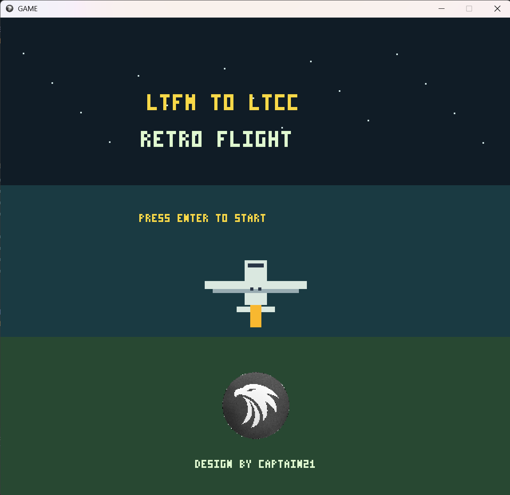
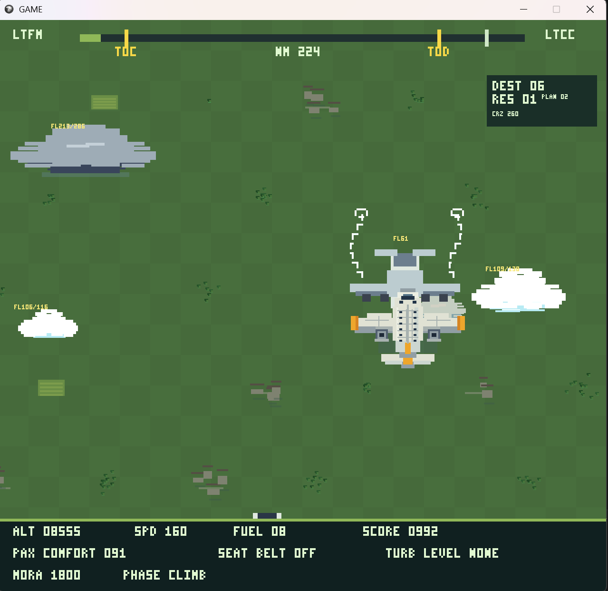
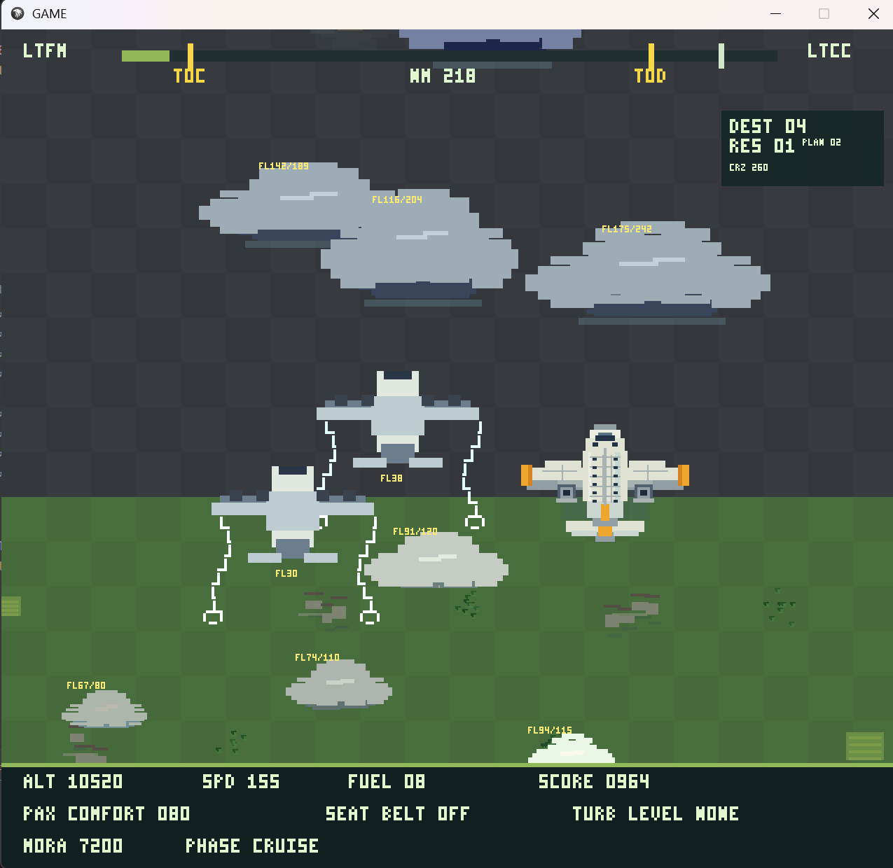

# LTFM TO LTCC — Retro Flight

> Pixel-art, top-down uçuş arkad oyunu. İstanbul'dan Ankara'ya gerçekçi bir uçuş deneyimi.



---

## Oyunun Amacı

Sen bir ticari uçak kaptanısın. İstanbul Sabiha Gökçen (**LTFM**) pistinden kalkış yapıp Ankara Esenboğa (**LTCC**) pistine güvenle iniş yapman gerekiyor.

Basit görünüyor — ama değil.

Yakıtını idareli kullan, yolcularını rahat tut, trafikten kaç, türbülanstan korun ve son olarak ILS yaklaşmasını başarıyla tamamla.

---

## Oynanış

| Tuş | Eylem |
|-----|-------|
| `Enter` | Oyunu başlat / yeniden başlat |
| `Shift` | Tırman / alçalışı kes |
| `Ctrl` | Alçal |
| `←` `→` | Uçağı sola/sağa hareket ettir |
| `S` | Emniyet kemeri aç/kapat |
| `Esc` | Çıkış |

---

## Ekran Görüntüleri

### Kalkış & Tırmanış


### Cruise & TCAS Uyarısı


---

## Ne Yapmalısın?

### 1. Kalkış
Piste hizalanmış olarak başlarsın. Hız **150 kts** civarına gelince `Shift` ile tırmanışa geç.  
Geç kalırsan veya erken çekersen — kaza.

### 2. Tırmanış & Cruise
- `Shift` ile irtifa kazan, `Ctrl` ile alçal
- **FL260** (26.000 ft) hedef cruise irtifandır
- Yakıtını dikkatli yönet — varışta en az **2.4** birim bırakmalısın
- **MORA** uyarısı çıkarsa irtifanı artır, yoksa 5 saniye içinde kaza

### 3. Trafik & TCAS
Karşıdan gelen ve yan geçen trafik uçakları var. TCAS uyarısı geldiğinde komuta göre in veya çık.  
Çarpışma = oyun bitti.

### 4. Türbülans
Bulut kümelerine girersen türbülans başlar. Emniyet kemeri açıksa yolcu konforu daha az etkilenir.  
Çok uzun süre kemer açık kalmak da konforu düşürür — dengeli kullan.

### 5. ILS Yaklaşması
20 NM kala otomatik yaklaşma moduna geçilir.  
- `←` `→` ile **LOC** sapmasını düzelt  
- `Shift` / `Ctrl` ile **V/S** ayarla  
- PAPI ışıklarına bak: **2 kırmızı + 2 beyaz** = ideal süzülüş  
- Çok sert inersen (>600 fpm) — HARD LANDING

---

## Skor Sistemi

| Durum | Etki |
|-------|------|
| Fazla yakıt ile varış | +Puan |
| Türbülans içinde uçmak | −Puan & −Konfor |
| MORA altında kalmak | −Puan (5 sn sonra kaza) |
| LOC sapması >75% | −Puan |
| Yumuşak iniş (<300 fpm) | **+450 Bonus** |
| Sert iniş (>600 fpm) | Oyun bitti |

---

## Kurulum

### Hazır EXE (Windows)
1. [Releases](https://github.com/ihsanburak/GAME/releases/tag/v1.1) sayfasından **GAME-v1.1-win-x64.zip** indir
2. ZIP'i aç
3. `GAME.exe`'yi çift tıkla — .NET kurulu olmasa da çalışır

### Kaynak Koddan Derleme
```bash
git clone https://github.com/ihsanburak/GAME.git
cd GAME
dotnet run
```
Gereksinimler: [.NET 8 SDK](https://dotnet.microsoft.com/download/dotnet/8.0)

---

## Teknik Bilgi

- **Motor:** MonoGame 3.8 (DesktopGL)
- **Dil:** C# / .NET 8
- **Çözünürlük:** 640×600 (2× ölçekli 1280×1200 pencere)
- **Grafik:** Tamamen kod ile çizilmiş — sprite dosyası yok
- **Ses:** OGG/WAV tabanlı müzik ve SFX

---

## Geliştirici

**CAPTAIN21**

*Design by Captain21*
